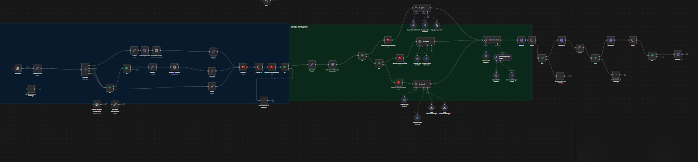

VentaEntradas-N8N

Este proyecto implementa un backend conversacional para venta de entradas basado en estados utilizando n8n, PostgreSQL, Redis e inteligencia artificial.

El flujo expone un webhook que recibe mensajes de usuarios, normaliza la entrada, interpreta múltiples formatos, detecta intención, mantiene contexto de sesión, ejecuta acciones de negocio y responde según el estado de la conversación.

¿Qué hace este workflow?

• Recibe mensajes vía Webhook  
• Soporta texto, audio e imágenes  
• Descarga y transcribe audios automáticamente  
• Analiza imágenes mediante IA  
• Normaliza entrada multicanal  
• Detecta intención del usuario usando agentes LLM  
• Mantiene sesiones persistentes en Redis y PostgreSQL  
• Consulta base de datos de usuarios y roles  
• Enruta conversaciones según rol (Administrador, Promotor, Vendedor)  
• Ejecuta sub-workflows como herramientas  
• Solicita datos faltantes sin perder contexto  
• Maneja estados conversacionales (state machine)  
• Formatea respuestas optimizadas para WhatsApp  
• Responde como API REST lista para integrarse con Chatwoot, WhatsApp, frontends o CRMs  

Intenciones soportadas

GENERATE_PAYMENT_LINK  
CONFIRM_PAYMENT  
GET_EVENTS  
GET_TICKETS  
VALIDATE_USER  
HUMAN  
HELP / GREETING  

Fallback seguro para UNKNOWN

Modelo de Estados

NEW → COLLECTING_DATA → READY → EXECUTING → DONE  

El contexto se persiste como JSON y se reutiliza entre mensajes.  
Se limpia automáticamente al finalizar cada flujo.

Tecnologías

• n8n (self-hosted)  
• PostgreSQL  
• Redis  
• OpenAI  
• JavaScript (Code Nodes)  
• Webhooks REST  
• JSON / JSONB  
• Arquitectura por estados  

Estructura del repositorio

docs/  
workflow/  
database/  
README.md  

Cómo usarlo

Importar el archivo JSON del workflow en n8n  

Configurar credenciales:

• PostgreSQL  
• Redis  
• OpenAI  

Crear las tablas usando los scripts de database  

Exponer el webhook y enviar requests tipo:

{
  "message": "quiero comprar 2 entradas para el evento de mañana",
  "user_id": "user_demo",
  "source": "whatsapp"
}

Objetivo del proyecto

Este flujo fue creado como proyecto integral de automatización conversacional con foco en:

• diseño conversacional  
• control de estado  
• uso práctico de IA  
• separación entre decisión y ejecución  
• arquitectura escalable  

